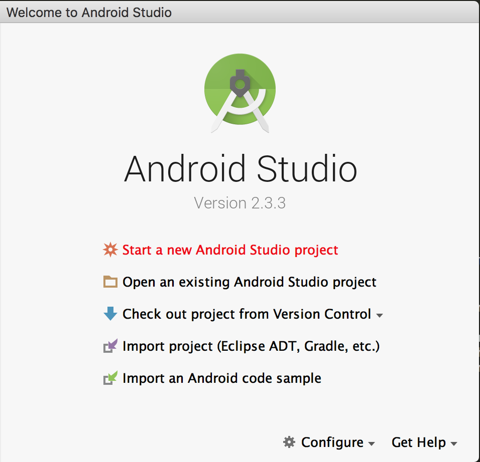
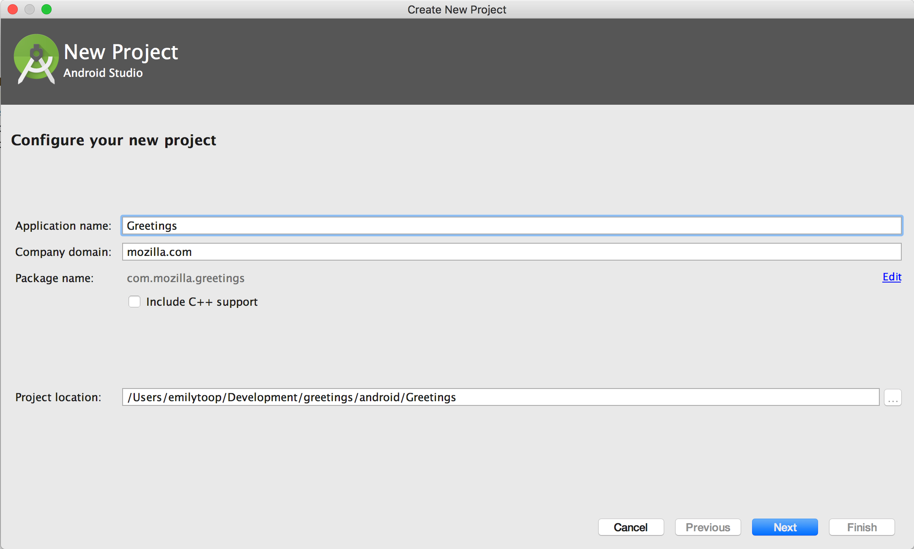
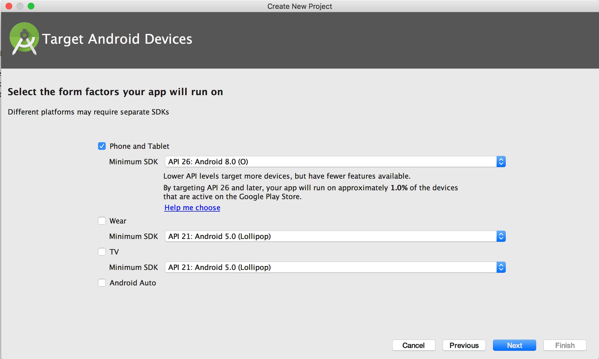
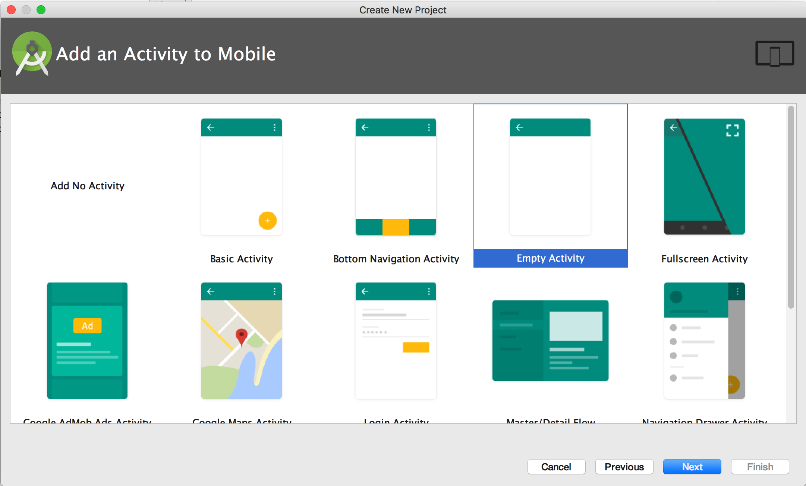
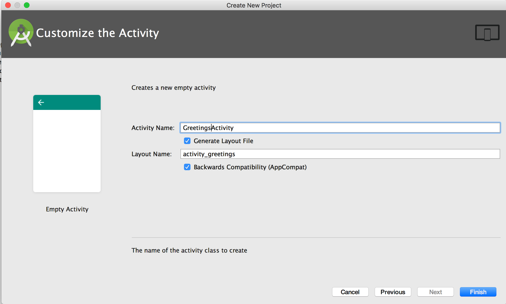
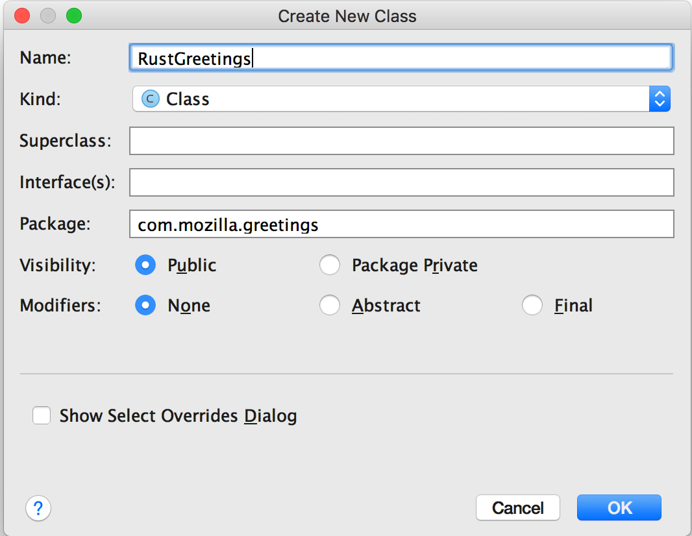
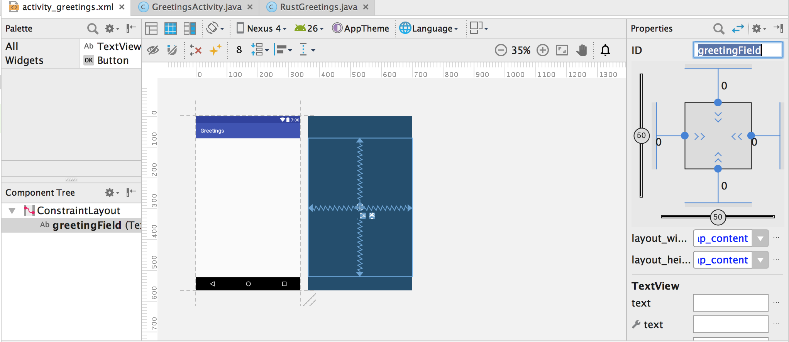

# Building and Deploying a Rust library on Android

Following on from the last post on getting a Rust library [building on iOS](https://mozilla.github.io/firefox-browser-architecture/experiments/2017-09-06-rust-on-ios.html), we're now going to deploy the same library on Android.

In order to do Android development, we'll need to set up our Android environment. First we need to install [Android Studio](https://developer.android.com/studio/index.html). Once Android Studio is installed, we'll need to install the NDK (Native Development Kit). 

Open Android Studio. From the toolbar, go to `Android Studio > Preferences > Appearance & Behaviour > Android SDK > SDK Tools`. Check the following options for installation and click `OK`.

    * Android SDK Tools
    * NDK 
    * CMake 
    * LLDB 

Once the NDK and associated tools have been installed, we need to set a few environment variables, first for the SDK path and the second for the NDK path. Set the following envvars:

```
export ANDROID_HOME=/Users/$USER/Library/Android/sdk
export NDK_HOME=$ANDROID_HOME/ndk-bundle
```

If you do not already have Rust installed, we need to do this now. For this we will be using [rustup](https://www.rustup.rs/). `rustup` installs Rust from the official release channels and enables you to easily switch between different release versions. It will be useful to you for all your future Rust development, not just here. `rustup` can also be used in conjunction with `HomeBrew`.

```
curl https://sh.rustup.rs -sSf | sh
```

The next step is to create standalone versions of the NDK for us to compile against. We need to do this for each of the architectures we want to compile against. We will be using the `make_standalone_toolchain.py` script inside the main Android NDK in order to do this. First create a directory for our project.

```
mkdir greetings
cd greetings
```

Now let's create our standalone NDKs. There is no need to be inside the `NDK` directory once you have created it to do this.

```
mkdir NDK
${NDK_HOME}/build/tools/make_standalone_toolchain.py --unified-headers --api 21 --arch arm64 --install-dir NDK/arm64
${NDK_HOME}/build/tools/make_standalone_toolchain.py --unified-headers --api 14 --arch arm --install-dir NDK/arm
${NDK_HOME}/build/tools/make_standalone_toolchain.py --unified-headers --api 14 --arch x86 --install-dir NDK/x86
```

Create a new file, `cargo-config.toml`. This file will tell cargo where to look for the NDKs during cross compilation. Add the following content to the file, remembering to replace instances of `<project path>` with the path to your project directory.

```
[target.aarch64-linux-android]
ar = "<project path>/greetings/NDK/arm64/bin/aarch64-linux-android-ar"
linker = "<project path>/greetings/NDK/arm64/bin/aarch64-linux-android-clang"

[target.armv7-linux-androideabi]
ar = "<project path>/greetings/NDK/arm/bin/arm-linux-androideabi-ar"
linker = "<project path>/greetings/NDK/arm/bin/arm-linux-androideabi-clang"

[target.i686-linux-android]
ar = "<project path>/greetings/NDK/x86/bin/i686-linux-android-ar"
linker = "<project path>/greetings/NDK/x86/bin/i686-linux-android-clang"
```

We can leave this here if we only want to compile for Android this one time, however if this is something we think we'll want to do several times, we should copy this file to Cargo's config directory.

```
cp cargo-config.toml ~/.cargo/config
```

Let's go ahead and add our newly created Android architectures to `rustup` so we can use them during cross compilation:

```
rustup target add aarch64-linux-android armv7-linux-androideabi i686-linux-android
```

Now we're all set up and we're ready to start. Let's create the `lib` directory. If you've already created a Rust project from following the iOS post, you don't need to do it again.

```
cargo new cargo
mkdir android
```

`cargo new cargo` sets up a brand new Rust project with its default files and directories in a directory called `rust`. The name of the directory is not important. In this directory is a file called `Cargo.toml`, which is the package manager descriptor file, and there is be a subdirectory, `src`, which contains a file called `lib.rs`. This will contain the Rust code that we will be executing.

Our Rust project here is a super simple Hello World library. It contains a function `rust_greeting` that takes a string argument and return a greeting including that argument. Therefore, if the argument is "world", the returned string is "Hello world". 

Open `cargo/src/lib.rs` and enter the following code.

```rust
use std::os::raw::{c_char};
use std::ffi::{CString, CStr};

#[no_mangle]
pub extern fn rust_greeting(to: *const c_char) -> *mut c_char {
    let c_str = unsafe { CStr::from_ptr(to) };
    let recipient = match c_str.to_str() {
        Err(_) => "there",
        Ok(string) => string,
    };

    CString::new("Hello ".to_owned() + recipient).unwrap().into_raw()
}
```

Let's take a look at what is going on here. 

As we will be calling this library from non-Rust code, we will actually be calling it through a C bridge. `#[no_mangle]` tells the compiler not to mangle the function name as it usually does by default, ensuring our function name is exported as if it had been written in C.

`extern` tells the Rust compiler that this function will be called from outside of Rust and to therefore ensure that it is compiled using C calling conventions.

The string that `rust_greeting` accepts is a pointer to a C char array. We have to then convert the string from a C string to a Rust `str`. First we create a `CStr` object from the pointer. We then convert it to a `str` and check the result. If an error has occurred, then no arg was provided and we substitute `there`, otherwise we use the value of the provided string. We then append the provided string on the end of our greeting string to create our return string. The return string is then converted into a `CString` and passed back into C code. 

Now let's create our Android project.

Open Android Studio and select `Start a New Android Project` from the options. 



On the next screen, type a project name of `Greetings` into the `Application name` field, choose your `Company domain` and select the `android` directory we created earlier as the `Project location`. This will create your Android project inside `greetings/android/Greetings`. Click `Next`.



On the next screen, make sure the `Phone and Tablet` option is selected. Click `Next`.



Now we will be asked to choose a starting activity. Select the `Empty Activity` option and click `Next`. 



Name your Activity and layout on the following screen, calling the activity `GreetingsActivity` and the layout `activity_greetings`. Click `Finish`.



As with iOS, we're going to create a wrapper class to wrap the C API and JNI bindings. In the project explorer on the left hand side of the studio window, ensure that `app > java > <domain>.greetings` is highlighted then go to `File > New > Java Class`. Name your class `RustGreetings` and click `OK`.



In your new class file, add the following code. Here we are defining the native interface to our Rust library and calling it `greeting`, with the same signature. The `sayHello` method simply makes a call to that native function.

```java
public class RustGreetings {

    private static native String greeting(final String pattern);

    public String sayHello(String to) {
        return greeting(to);
    }
}
```

Instead of creating  C header that will be used as a bridge as we did when we wanted to integrate with Swift, for Android we want to expose our functions through JNI. The way that JNI constructs the name of the function that it will call is `Java_<domain>_<class>_<methodname>`. In the case of the method, `greeting` that we have declared here, the function in our Rust library that JNI will attempt to call will be `Java_com_mozilla_greetings_RustGreetings_greeting`. This is the reason why we created our Android project and Java wrapper class before adding any JNI code to the Rust library. We needed to know what the domain, class and function name were before we could construct the right JNI function name in Rust. Let's head back over to our Rust project and create the partner code.

Open `cargo/src/lib.rs`. At the bottom of the file add the following code:

```rust
/// Expose the JNI interface for android below
#[cfg(target_os="android")]
#[allow(non_snake_case)]
pub mod android {
    extern crate jni;

    use super::*;
    use self::jni::JNIEnv;
    use self::jni::objects::{JClass, JString};
    use self::jni::sys::{jstring};

    #[no_mangle]
    pub unsafe extern fn Java_com_mozilla_greetings_RustGreetings_greeting(env: JNIEnv, _: JClass, java_pattern: JString) -> jstring {
        let world = rust_greeting(env.get_string(java_pattern).expect("invalid pattern string").as_ptr());
        let output = env.new_string(CStr::from_ptr(world).to_str().unwrap()).expect("Couldn't create java string!");
        rust_greeting_free(world);

        output.into_inner()
    }
}
```

The first line here `#[cfg(target_os="android")]` is telling the compiler to target Android when compiling this module. `#[cfg]` is a special attribute that allows you to compile code based on a flag passed to the compiler. 

The second line, `#[allow(non_snake_case)]`, tells the compiler not to warn if we are not using `snake_case` for a variable or function name. The Rust compiler is very strict — this is one of the things that makes Rust great — and it enforces the use of `snake_case` throughout. However, we defined our class name and native method in our Android project using Java coding conventions which is `camelCase` and `UpperCamelCase` and we don't want to change this or our Java code will look wrong. Given the way that JNI constructs native function names, we need to tell the Rust compiler to go easy on us in this instance. This flag will apply to all functions and variables created inside this module that we are creating, called `android`. 

After declaring that we need the `jni` crate, and importing some useful objects from it, we can declare our function. This function needs to be marked `unsafe` because we will be dealing with pointers from a language that allows null pointers, but our code doesn't check for `NULL`. This situation would never happen in Rust only code as the Rust compiler enforces memory safety. By marking the function as not memory safe, we are alerting other Rust functions that it may not be able to deal with a null pointer. `extern` defines the function as one that will be exposed to other languages. 

As arguments, along with the `JString` that our Java function declaration said that we will be providing, we also need to take an instance of the `JNIEnv` and a class reference. The `JNIEnv` will be the object we will use to read values associated with the pointers that we are taking as argument.

Next, we read the string in from the `JNIEnv` and convert it into a C pointer to pass to `rust_greeting`. The result of that function is another C pointer, which we then need to convert to a back into a String. Using the `JNIEnv` transfers the ownership of the object to Java, but there is still a reference hanging around held by our Rust code. We need to call `rust_greetings_free` to free that memory. Then we return our String.

We declared that we needed the `jni` crate, that means we need to include the crate in the `Cargo.toml` file. Open it up and add the following between the `[package]` and `[lib]` declarations.

```
[target.'cfg(target_os="android")'.dependencies]
jni = { version = "0.5", default-features = false }
```

We are now ready to build our libraries. Unlike with iOS, there is no handy universal Android library that we can make so we have to create one for each of our target architectures. We can then create symlinks to them from the Android project. Navigate to your `cargo` directory and run the following commands:

```
cargo build --target aarch64-linux-android --release
cargo build --target armv7-linux-androideabi --release
cargo build --target i686-linux-android --release

cd ../android/Greetings/app/src/main
mkdir jniLibs
mkdir jniLibs/arm64
mkdir jniLibs/armeabi
mkdir jniLibs/x86

ln -s <path>/cargo/target/aarch64-linux-android/release/libgreetings.so jniLibs/arm64/libgreetings.so
ln -s <path>/cargo/target/armv7-linux-androideabi/release/libgreetings.so jniLibs/armeabi/libgreetings.so
ln -s <path>/cargo/target/i686-linux-android/release/libgreetings.so jniLibs/x86/libgreetings.so
```

Now, head back to Android Studio and open `GreetingsActivity.java`. We need to load our Rust library when the app starts, so add the following lines below the class declaration and before the `onCreate` method.

```java
   static {
        System.loadLibrary("greetings");
    }
```

This looks for a library called `greetings.so` inside the jniLibs directory and picks the correct one for the current architecture.

Open `activity-greetings.xml`. In the `Component Tree` panel, highlight the `TextField` and open the `Properties` panel. Change the `ID` in the `Properties` panel to `greetingField`. This is how we are going to refer to it from our Activity.



Reopen `GreetingsActivity.java` and amend the `onCreate` method to call our greetings function and set the text on the `greetingField` `TextField` to the response value.

```java
    @Override
    protected void onCreate(Bundle savedInstanceState) {
        super.onCreate(savedInstanceState);
        setContentView(R.layout.activity_greetings);

        RustGreetings g = new RustGreetings();
        String r = g.sayHello("world");
        ((TextView)findViewById(R.id.greetingField)).setText(r);
    }
```

Build and run the app. If this is your first time in Android Studio, you may need to set up a simulator. When choosing/creating your simulator pick one with API 26. When the app starts, `Hello world` will be printed on your screen.

You can find the code for this on [Github](https://github.com/fluffyemily/cross-platform-rust).